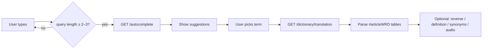

# WordReference Unofficial API Guide

WordReference has no public JSON API. Clients talk to the same endpoints the website uses: a tab-separated **autocomplete** service, full HTML dictionary pages, and smaller HTML **partials** loaded by the tab UI. You parse translations out of the HTML (or use a scraper package that does it for you).

This guide is based on live requests against `www.wordreference.com` and the sample pages in this repo (`page.html`, `esen.html`, `fren.html`, `nf.html`, `def.html`, `syn.html`).

> Unofficial and unsupported. Markup and URLs can change. Be respectful: cache results, rate-limit, and send a normal browser `User-Agent`. Full dictionary pages return **403** without a browser-like UA; autocomplete and `/dictionary/*` partials are more permissive.

---

## Base URL

```
https://www.wordreference.com
```

---

## 1. Autocomplete (suggest)

Suggests headwords for a dictionary as you type.

```
GET /autocomplete?dict={dict}&query={prefix}
```

### Parameters

| Param   | Required | Description                                      |
|---------|----------|--------------------------------------------------|
| `dict`  | yes      | Dictionary code, e.g. `enes`, `esen`, `enfr`   |
| `query` | yes      | Prefix to match                                  |

### Short queries

- Queries **shorter than 2 characters** return an empty body.
- The site UI often avoids calling suggest until the query is long enough (commonly described as **&lt; 3 characters** being redirected / suppressed). Prefer waiting until at least 2–3 characters before requesting.

### Response shape

- **Content-Type:** `text/html; charset=utf-8` (despite being TSV text)
- **Status:** often **404** even when suggestions are returned — ignore status and parse the body when it is non-empty
- **Body:** newline-separated rows, fields separated by **tabs**

```
{term}\t{lang}\t{frequency}\t{flag}
```

| Field       | Type   | Meaning |
|-------------|--------|---------|
| `term`      | string | Suggested headword (may include spaces, hyphens, accents) |
| `lang`      | string | Language of the suggestion (`en`, `es`, `fr`, …) for that dictionary |
| `frequency` | int    | Popularity / ranking score (higher ≈ more common) |
| `flag`      | `0`\|`1` | Extra marker (often `1` on verbs / conjugable forms; treat as opaque unless you find a use) |

### Example

```http
GET https://www.wordreference.com/autocomplete?dict=enes&query=he
```

```
hence	en	14283	0
hear	en	14208	1
held	en	12297	0
heat	en	11877	1
help	en	11029	1
...
hecho	es	4559	0
herida	es	4099	0
herramienteros	es	3837	0
```

For bilingual dicts like `enes`, English matches usually come first, then Spanish (and vice versa for `esen`). Order within a language is roughly by frequency descending.

### Parse example (TypeScript)

```ts
interface Suggestion {
  term: string;
  lang: string;
  frequency: number;
  flag: number;
}

function parseAutocomplete(body: string): Suggestion[] {
  return body
    .trim()
    .split(/\r?\n/)
    .filter(Boolean)
    .map((line) => {
      const [term, lang, frequency, flag] = line.split("\t");
      return {
        term,
        lang,
        frequency: Number(frequency),
        flag: Number(flag),
      };
    });
}
```

---

## 2. Translation lookup

There are two useful ways to get the same translation tables.

### A. Full page (includes headword, audio, pronunciation, forums, etc.)

```
GET /{dict}/{term}
```

Examples:

- `https://www.wordreference.com/enes/hello`
- `https://www.wordreference.com/esen/hola`
- `https://www.wordreference.com/fren/bonjour`

Send a browser `User-Agent`. Without one, nginx often responds with **403**.

See `page.html` for a saved English→Spanish `hello` response.

### B. AJAX translation partial (lighter; preferred for scraping)

```
GET /dictionary/translation?dict={dict}&w={term}
```

Example:

```http
GET https://www.wordreference.com/dictionary/translation?dict=enes&w=hello
```

Returns an HTML fragment centered on `#articleWRD` — the same `table.WRD` markup as the full page, without chrome/ads. This is what the site loads for the WordReference tab:

```js
url: `/dictionary/translation?dict=enes&w=hello`
```

### Related partials (same tab UI)

| Endpoint | Purpose |
|----------|---------|
| `/dictionary/translation?dict={dict}&w={term}` | Principal WR translations |
| `/dictionary/reverse?dict={dict}&w={term}` | Reverse dictionary hits (target→source sense of the term) |
| `/dictionary/getcollins/{dict}/{term}` | Collins bilingual entry (when available) |
| `/dictionary/definition?w={term}` | English definition (Random House / related) |
| `/dictionary/synonyms?w={term}` | English thesaurus |
| `/dictionary/EnglishCollocations?w={term}` | English collocations |

Human-readable aliases also exist, e.g. `/definition/hello`, `/synonyms/hello`.

---

## 3. HTML structure (how to extract translations)

All bilingual WR results live under:

```html
<div id="articleWRD">
  <table class="WRD" data-dict="enes"> … </table>
  <table class="WRD" id="compound_forms" data-dict="enes"> … </table>
</div>
```

### Sections

Each `table.WRD` starts with a section header row:

```html
<tr class="wrtopsection">
  <td … id="regular" title="Principal Translations">…</td>
</tr>
```

Common section `id`s / titles:

| `id`          | Title                      | Notes |
|---------------|----------------------------|-------|
| `regular`     | Principal Translations     | Main senses |
| `additional`  | Additional Translations    | Less common senses |
| `compounds`   | Compound Forms             | Often on `table#compound_forms` |
| *(varies)*    | Phrasal Verbs / etc.       | Depends on language pair |

Skip `tr.langHeader` (column labels) and copyright noise inside the table.

### Entry rows

A sense group is a sequence of `tr.odd` / `tr.even` rows that share the same zebra class until the next sense with a different id / new `FrWrd` headword.

**Main sense row** (has entry id + from-word + sense + translation):

```html
<tr class="odd" id="enes:884:1">
  <td class="FrWrd">
    <strong>hello,<br> also UK: hallo,<br>hullo</strong>
    <em class="POS2" data-lang="en" data-abbr="interj">interj</em>
  </td>
  <td>(greeting)</td>
  <td class="ToWrd">
    hola <em class="POS2" data-lang="es" data-abbr="interj">interj</em>
  </td>
</tr>
```

**Continuation translation** (same sense, another target):

```html
<tr class="odd">
  <td>&nbsp;</td>
  <td>&nbsp;</td> <!-- or register note -->
  <td class="ToWrd">
    diga <em class="POS2" data-lang="es" data-abbr="interj">interj</em>
  </td>
</tr>
```

**Examples:**

```html
<tr class="odd">
  <td>&nbsp;</td>
  <td colspan="2" class="FrEx"><span dir="ltr">Hello. How are you?</span></td>
</tr>
<tr class="odd">
  <td>&nbsp;</td>
  <td colspan="2" class="ToEx" dir="ltr">¡Hola! ¿Cómo estás?</td>
</tr>
```

### Field cheat sheet

| Selector / attribute | Meaning |
|----------------------|---------|
| `tr[id^="{dict}:"]` | Start of a sense; id like `enes:884:1` |
| `td.FrWrd strong` | Source term / variants |
| `td.FrWrd em.POS2` | Source part of speech (`data-abbr`) |
| middle `td` (no Fr/To class) | Sense gloss, e.g. `(greeting)` |
| `i.Fr2` | Register / region on source side (`informal`, `UK`, …) |
| `span.dsense` | Sense/register note on target side (`AmL`, `coloquial`, …) |
| `td.ToWrd` | Target translation + `em.POS2` |
| `td.FrEx` | Example in source language |
| `td.ToEx` | Example in target language |
| `a.conjugate` | Link to conjugator for verbs |

### Recommended parse model

```ts
interface Translation {
  text: string;
  pos?: string;          // from em.POS2[data-abbr]
  note?: string;         // dsense / middle-cell notes
}

interface Sense {
  id?: string;           // e.g. enes:884:1
  from: string;
  fromPos?: string;
  sense?: string;        // middle column gloss
  register?: string[];   // Fr2 + dsense labels
  to: Translation[];
  examples: { from?: string; to?: string }[];
}

interface Section {
  id: string;            // regular | additional | compounds | …
  title: string;
  senses: Sense[];
}
```

Walk each `table.WRD` in order:

1. Read `tr.wrtopsection` for section metadata.
2. For each subsequent `tr.odd` / `tr.even`:
   - If the row has `td.FrWrd` with a non-empty `strong`, start a new `Sense`.
   - Else if it has `td.ToWrd`, append another translation to the current sense.
   - Else if it has `td.FrEx` / `td.ToEx`, attach examples (pair FrEx then ToEx when both appear).
3. Stop at the next `wrtopsection` or end of table.

Cheerio works well in Node:

```ts
import * as cheerio from "cheerio";

const $ = cheerio.load(html);
const tables = $("#articleWRD table.WRD");
// walk tr as above…
```

### Headword metadata (full page only)

On the full page (`#articleHead`), also available:

| Element | Content |
|---------|---------|
| `h1.headerWord` | Queried term |
| `#pronunciation_widget .pronWR` / `.pronRH` | IPA / respelling |
| `window.audioFiles` | Array of MP3 paths, e.g. `/audio/en/uk/general/en042667.mp3` |
| `.inflectionsSection` | Inflection lists |
| `var strDic` / `wrserver.ddict` | Active dictionary metadata |

Absolute audio URL:

```
https://www.wordreference.com/audio/en/uk/general/en042667.mp3
```

### No results

Missing terms render `#noTransFound` (see `nf.html`):

```html
<div id="noTransFound">
  <p id="noEntryFound" title="No translation found for 'zzzqqqxx'">
    No translation found for 'zzzqqqxx'.
  </p>
  <div id="spellSug">… Did you mean? …</div>
</div>
```

Also check `#articleWRD` emptiness / spell suggestions before treating a response as a successful entry.

---

## 4. Dictionary codes

Codes are usually `{from}{to}` language pairs (ISO-like 2-letter codes). Opposite direction flips the pair (`enes` ↔ `esen`).

From the site’s `validDictionaries` list (not exhaustive of every UI label):

| Code | Pair |
|------|------|
| `enes` / `esen` | English ↔ Spanish |
| `enfr` / `fren` | English ↔ French |
| `enit` / `iten` | English ↔ Italian |
| `enpt` / `pten` | English ↔ Portuguese |
| `ende` / `deen` | English ↔ German |
| `ennl` / `nlen` | English ↔ Dutch |
| `ensv` / `sven` | English ↔ Swedish |
| `enru` / `ruen` | English ↔ Russian |
| `enpl` / `plen` | English ↔ Polish |
| `enro` / `roen` | English ↔ Romanian |
| `encz` / `czen` | English ↔ Czech |
| `engr` / `gren` | English ↔ Greek |
| `entr` / `tren` | English ↔ Turkish |
| `enzh` / `zhen` | English ↔ Chinese |
| `enja` / `jaen` | English ↔ Japanese |
| `enko` / `koen` | English ↔ Korean |
| `enar` / `aren` | English ↔ Arabic |
| `esfr` / `fres` | Spanish ↔ French |
| `espt` / `ptes` | Spanish ↔ Portuguese |
| `esit` / `ites` | Spanish ↔ Italian |
| `esde` / `dees` | Spanish ↔ German |
| `frit` | French ↔ Italian |

Monolingual / special:

| Code | Purpose |
|------|---------|
| `enen` | English definition |
| `enthe` | English synonyms (also `/synonyms/{w}`) |
| `encol` | English collocations |
| `eses` | Spanish definition |
| `essin` | Spanish synonyms |
| `esgram` | Spanish grammar |
| `enusg` | English usage |
| `caca` | Catalan |

URL form for bilingual lookup is always `/{dict}/{term}` with the term path-encoded (`good%20morning`, accented chars as UTF-8 percent-encoding).

---

## 5. Typical client flow



1. Debounce input; call autocomplete when `query.length >= 2` (or 3 to match the site UI).
2. On selection (or submit), fetch `/dictionary/translation?dict=…&w=…` (or the full `/{dict}/{term}` page if you need audio/pronunciation in one shot).
3. Parse `#articleWRD` into sections → senses → translations + examples.
4. Optionally hydrate other tabs from the `/dictionary/*` partials.

---

## 6. Existing npm packages

You do **not** have to write a parser from scratch. Community scrapers already target this HTML (they can break when WR changes markup):

| Package | Notes |
|---------|--------|
| [`wordreference-api`](https://www.npmjs.com/package/wordreference-api) | Classic scraper; returns JSON with principal/compound translations, pronunciation, audio |
| [`multi-dictionary-scraper`](https://www.npmjs.com/package/multi-dictionary-scraper) | WR + Linguee; documents `td.FrEx` / `td.ToEx` extraction |
| [`wordreference-definition-api`](https://www.npmjs.com/package/wordreference-definition-api) | English definitions from `/definition/` |

For this project, parsing yourself with **cheerio** against `/dictionary/translation` is usually enough and keeps dependencies minimal. Prefer the AJAX partial over the full page when you only need translations.

---

## 7. Practical request notes

```ts
const headers = {
  "User-Agent":
    "Mozilla/5.0 (Windows NT 10.0; Win64; x64) AppleWebKit/537.36 (KHTML, like Gecko) Chrome/120.0.0.0 Safari/537.36",
  Accept: "text/html,application/xhtml+xml,*/*;q=0.8",
};
```

- Autocomplete: treat non-empty body as success even if status is 404.
- Full pages: require a realistic UA (403 otherwise).
- Encode terms with `encodeURIComponent` for query params; for path segments, encode spaces and special characters the same way the site does (`hello`, `good%20morning`).
- Do not hammer the service; cache by `(dict, term)`.

---